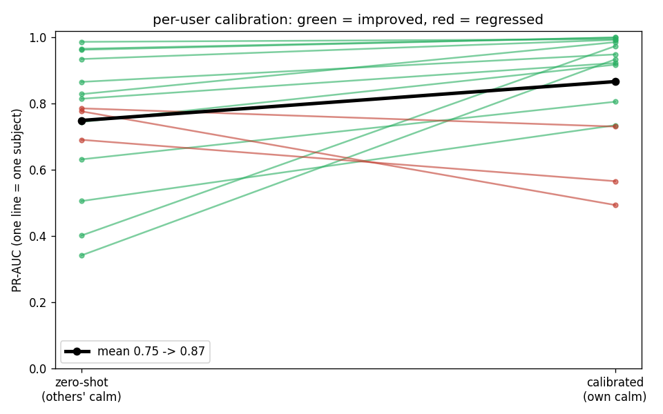

# one-class stress detection — results (O1/O2)

first full run on WESAD wrist BVP. one-class setup: train on **baseline (calm)**
windows, flag **stress (TSST)** as the positive. evaluated **leave-one-subject-out**
(train on 14 people's calm data, test on the held-out person) — no subject leakage.

- signal: wrist BVP @ 64 Hz (the cheap-sensor analogue; chest ECG ignored on purpose)
- windows: 60 s, 5 s step, pure (one condition per window)
- 15 subjects, ~220 calm / ~120 stress windows each
- trained on GPU (RTX 2070 SUPER)


## headline (mean ± std across 15 subjects)

| model | PR-AUC | recall@90% spec | ROC-AUC |
|---|---|---|---|
| baseline (Mahalanobis on features) | 0.635 ± 0.249 | 0.437 ± 0.326 | 0.723 ± 0.213 |
| **autoencoder (O1)** | **0.667 ± 0.228** | **0.507 ± 0.328** | **0.759 ± 0.189** |
| **SSL contrastive (O2)** | **0.676 ± 0.204** | 0.502 ± 0.286 | 0.753 ± 0.178 |


the autoencoder reconstructs calm well and stress poorly — the error gap is what
we threshold on (overlap is why recall is moderate):


- **O1 met:** the autoencoder beats the statistical baseline on PR-AUC and recall.
- **O2 met:** the self-supervised encoder has the best PR-AUC and the **smallest
  spread** across subjects (most consistent person-to-person).
- **recall@90% spec ≈ 0.50:** holding false alarms on calm data to 10%, the
  models catch ~half of stress windows.

## model improvement: giving the AE a real bottleneck

the original autoencoder is **over-complete** — for a 3,840-sample window its conv
latent is 240×128 = 30,720 values, ~8× *larger* than the input. an over-complete AE
learns a near-identity map, so it reconstructs stress almost as well as calm and the
two barely separate. forcing the encoder through a true compressed latent (a Dense
bottleneck) fixes it. sweeping the latent width (LOSO, 15 subjects, one harness run):

| AE config | PR-AUC | recall@90% spec | ROC-AUC | ~int8 size |
|---|---|---|---|---|
| original (no bottleneck) | 0.672 ± 0.235 | 0.507 ± 0.333 | 0.760 | 0.27 MB |
| bottleneck 64 | 0.620 ± 0.212 | 0.419 ± 0.297 | 0.744 | — |
| bottleneck 128 | 0.700 ± 0.203 | 0.529 ± 0.309 | 0.796 | — |
| **bottleneck 256** | **0.736 ± 0.190** | **0.576 ± 0.289** | **0.806** | 16 MB |
| **bottleneck 256 · ch-cap 32 (deployed)** | **0.706 ± 0.206** | **0.545 ± 0.298** | 0.780 | ~4 MB |

- the trend is monotonic (64 too tight → 256 the sweet spot): a real ~15× compression
  beats the over-complete original by **+0.064 PR-AUC / +0.069 recall**, with *lower*
  spread (std 0.235 → 0.190) — more consistent person-to-person.
- the full bottleneck-256 puts a 16M-param Dense layer (~16 MB int8) between encoder and
  decoder — fine for a Pi, too big for the ESP32-S3. capping encoder channels (128→32)
  keeps the same length-240 encoder + 256 latent at **~4 MB**, recovering most of the gain
  (0.706 vs 0.736) while fitting the **ESP32-S3-N16R8** (16 MB flash / 8 MB PSRAM) with
  room for firmware. **this is the deployed model.**
- caveat: the latent width and channel cap were picked on the LOSO metric, so the exact
  choice is mildly optimistic; the clean monotonic trend makes the *architecture* decision
  (add a real bottleneck) robust, not a fluke.

reproduce: `python3 -m anomaly.run --model ae --bottleneck 256 --ch-cap 32`

## the real finding: subject variance

per-subject PR-AUC ranges from near-perfect to near-chance (e.g. autoencoder:
S4 = 0.99, S14 = 0.97 … S6 = 0.30, S15 = 0.31). this is the **domain-transfer
story** — stress looks different person-to-person, so a model trained on others
transfers unevenly. it's the result to report honestly, not a bug to hide.

## per-user calibration closes much of the gap

the variance above is what a detector built on OTHER people gives. calibrating to
the user with a short slice of their OWN calm — the realistic "onboarding" step —
recovers most of it. Mahalanobis baseline, time-respecting split (the first half
of each subject's calm calibrates; the rest + all their stress is the test set):

| regime | PR-AUC | recall@90% spec |
|---|---|---|
| zero-shot (others' calm) | 0.750 ± 0.196 | 0.460 ± 0.313 |
| **calibrated (own calm)** | **0.867 ± 0.159** | **0.689 ± 0.321** |
| hybrid (both, pooled) | 0.758 ± 0.186 | 0.471 ± 0.310 |



- **+0.117 PR-AUC, +0.23 recall**, and a tighter spread (std 0.196 → 0.159).
- **hybrid barely helps (+0.008):** pooling drowns the personal signal under the
  population — a little of the user's own calm beats a lot of other people's.
- a few subjects regress (S10, S13, S15) when their calibration slice is small or
  noisy — calibration needs enough clean baseline.
- this is the **zero-shot vs device-calibrated** delta O6 asks for, shown on WESAD;
  the same protocol runs on our own device data once it exists.
- (zero-shot here is ~0.75, not 0.64 as in the table above — the test set differs
  because calibration holds out a calm slice; compare within this table only.)

regenerate: `python3 -m anomaly.calibrate`

## edge compression (O7)

the deployed model (**bottleneck-256 · ch-cap 32**) converts to TFLite for the device.
cost of compression, pooled calm-vs-stress windows (3,342 calm / 1,814 stress):

| model | PR-AUC | recall@90% | size | CPU latency / window |
|---|---|---|---|---|
| keras float32 (reference) | 0.903 | 0.820 | 46.7 MB | — |
| TFLite float32 | 0.903 | 0.820 | 15.6 MB | 1.85 ms |
| **TFLite int8** | 0.902 | 0.817 | **4.0 MB (4,122 KB)** | 1.49 ms |

- **int8 is 11.3× smaller** and fits the **ESP32-S3-N16R8** (16 MB flash / 8 MB PSRAM)
  with room for firmware + OTA.
- compression cost is negligible: PR-AUC 0.903 → 0.902, recall 0.820 → 0.817.
- **1.49 ms / 60-s window** — ~670× under the 1-second scoring budget.
- these PR-AUC/recall are **pooled** on the deployment model (trained on all subjects),
  so they measure the keras→int8 compression gap, *not* generalization — the honest
  cross-subject number is the LOSO **0.706** in "model improvement" above.

(previous original-AE compression — int8 287 KB, PR-AUC 0.660 pooled — is superseded.)

- **int8 is 11× smaller (3.2 MB → 287 KB)** — fits an ESP32-S3 / Pi with room to spare.
- compression cost: **PR-AUC −0.05, recall@90% unchanged** (0.427 → 0.429).
- \*latency here is desktop x86; int8 kernels are tuned for ARM, so on the Pi/ESP32
  int8 is the *faster, lower-power* path. both are far under the 1 s scoring budget.
- (PR-AUC 0.71 is pooled on the deployment model, not LOSO; the keras→int8 gap is
  the compression delta, which is the point.)

artifacts: `anomaly/saved/ae_int8.tflite` (+ `ae_float32.tflite`). regenerate:
`python3 -m anomaly.compress`

## caveats

- this is **stress only**. WESAD is a seated study with no exercise, so the
  **exertion** proxy isn't covered here (needs PPG-DaLiA or our own step-test data).
- this measures **subject-to-subject** transfer *within WESAD*. the harder
  **public-data → our-device** transfer (different sensor) is future work (O6),
  and the drop there will likely be larger.
- gains over the baseline are **real but modest** — a first pass, not a ceiling.

## reproduce

```bash
python3 -m anomaly.run --model baseline   # ~0.64 PR-AUC
python3 -m anomaly.run --model ae         # ~0.67 (O1)
python3 -m anomaly.run --model ssl        # ~0.68 (O2)
python3 -m anomaly.make_plots             # regenerate the figures above
```

(windowed data is cached after the first run, so re-runs skip the 13 GB read.)
