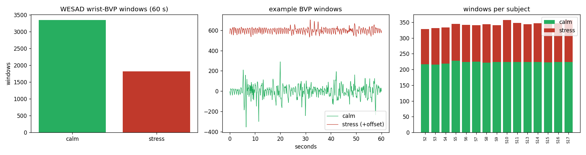
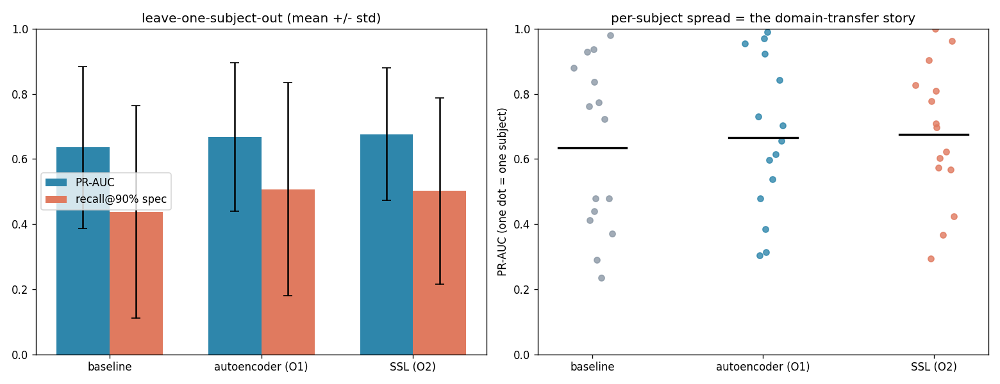
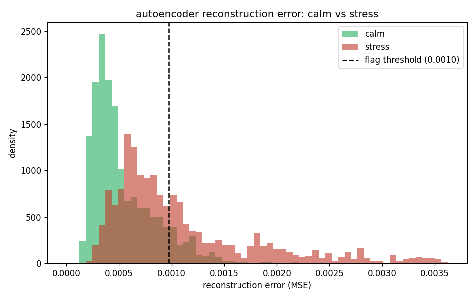

# one-class stress detection — results (O1/O2)

first full run on WESAD wrist BVP. one-class setup: train on **baseline (calm)**
windows, flag **stress (TSST)** as the positive. evaluated **leave-one-subject-out**
(train on 14 people's calm data, test on the held-out person) — no subject leakage.

- signal: wrist BVP @ 64 Hz (the cheap-sensor analogue; chest ECG ignored on purpose)
- windows: 60 s, 5 s step, pure (one condition per window)
- 15 subjects, ~220 calm / ~120 stress windows each
- trained on GPU (RTX 2070 SUPER)



## headline (mean ± std across 15 subjects)

| model | PR-AUC | recall@90% spec | ROC-AUC |
|---|---|---|---|
| baseline (Mahalanobis on features) | 0.635 ± 0.249 | 0.437 ± 0.326 | 0.723 ± 0.213 |
| **autoencoder (O1)** | **0.667 ± 0.228** | **0.507 ± 0.328** | **0.759 ± 0.189** |
| **SSL contrastive (O2)** | **0.676 ± 0.204** | 0.502 ± 0.286 | 0.753 ± 0.178 |



the autoencoder reconstructs calm well and stress poorly — the error gap is what
we threshold on (overlap is why recall is moderate):



- **O1 met:** the autoencoder beats the statistical baseline on PR-AUC and recall.
- **O2 met:** the self-supervised encoder has the best PR-AUC and the **smallest
  spread** across subjects (most consistent person-to-person).
- **recall@90% spec ≈ 0.50:** holding false alarms on calm data to 10%, the
  models catch ~half of stress windows.

## the real finding: subject variance

per-subject PR-AUC ranges from near-perfect to near-chance (e.g. autoencoder:
S4 = 0.99, S14 = 0.97 … S6 = 0.30, S15 = 0.31). this is the **domain-transfer
story** — stress looks different person-to-person, so a model trained on others
transfers unevenly. it's the result to report honestly, not a bug to hide.

## caveats

- this is **stress only**. WESAD is a seated study with no exercise, so the
  **exertion** proxy isn't covered here (needs PPG-DaLiA or our own step-test data).
- this measures **subject-to-subject** transfer *within WESAD*. the harder
  **public-data → our-device** transfer (different sensor) is future work (O6),
  and the drop there will likely be larger.
- gains over the baseline are **real but modest** — a first pass, not a ceiling.

## reproduce

```bash
python3 -m anomaly.run --model baseline   # ~0.64 PR-AUC
python3 -m anomaly.run --model ae         # ~0.67 (O1)
python3 -m anomaly.run --model ssl        # ~0.68 (O2)
python3 -m anomaly.make_plots             # regenerate the figures above
```

(windowed data is cached after the first run, so re-runs skip the 13 GB read.)
